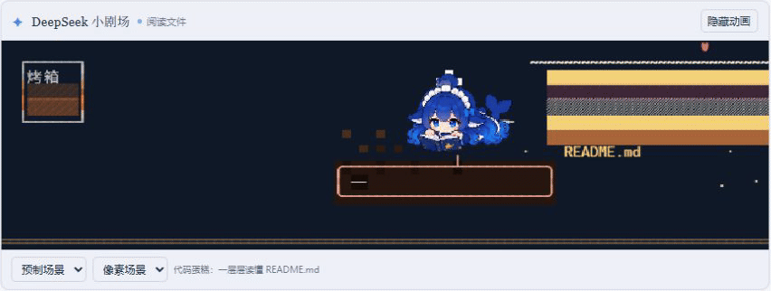
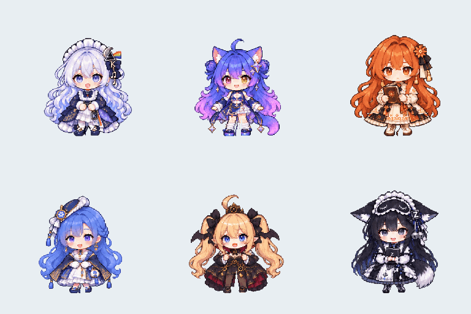

# DeepSeek Toons

[简体中文](README.md) · English

**A little company while you wait.**

<p>
  
  
</p>

**Requirements:** DeepSeek Harness `0.2.0-rc.2`. Only Windows Web and Desktop clients have been verified. Desktop uses its bundled runtime; Web commands require Node.js `22.19.0` or later (locally verified with `24.12.0`) and npm. Source development also requires Git.

## Quick start

**[Download dsh-toons-0.1.24.tgz](https://github.com/Hjh-12138/DSH-Pixel-Toons/releases/download/v0.1.24/dsh-toons-0.1.24.tgz)** · [Release and checksum](https://github.com/Hjh-12138/DSH-Pixel-Toons/releases/tag/v0.1.24)

For Desktop, open the app once, add the downloaded `.tgz` in its plugin manager, enable `dsh-toons`, then fully quit and reopen. Keep the installed tarball: the profile may still reference its local path. No source build is needed.

For Web, with Node.js and npm installed, stop any existing Web service and run these three PowerShell commands:

```powershell
npm install --global pnpm @deepseek-ai/dsh@0.2.0-rc.2
dsh plugin --profile web add "https://github.com/Hjh-12138/DSH-Pixel-Toons/releases/download/v0.1.24/dsh-toons-0.1.24.tgz"
dsh --profile web
```

The second command downloads and installs the Release directly. Continue only after each command succeeds. Existing users with the matching CLI and pnpm can skip the first command. Source build and Desktop CLI instructions are in the [development guide](docs/development.md).

## Features and privacy

- Task animations for reading, typing, thinking, searching, checking and completion, with local idle roaming.
- Twelve pixel themes with day/dusk variants, seven built-in characters, and local character/background imports.
- Collapsible controls, narrow-window layouts and support for reduced motion.
- Optional dynamic mode generates Chinese text bubbles and combines existing scene assets, with fallback and separate token accounting.

> [!IMPORTANT]
> **Dynamic mode sends task summaries to your configured model and adds model usage.** Summaries may include tool names, paths, commands, search terms, URLs or a short excerpt of user input. Default preset mode plays locally and makes no extra model requests for the animation.

Dynamic mode uses your session's provider/model unless overridden. It also sends the task phase, failure flag and character instructions; it does not copy the full main conversation, and the animation director does not execute tools. Truncation is not redaction. Imported resources stay in the current client's storage; usage logging is disabled by default. Normal chat model requests are separate from the animation mode.

## Customize and develop

Use the “本地资源” (local resources) panel to select a character or import ZIP/embedded-image JSON packs. Character and scene selections are independent. See [resource pack format](docs/local-resource-packs.md), [dynamic mode](docs/dynamic-scenes.md), [development notes](docs/development.md), [Windows auto-update](docs/desktop-auto-update.md) and [CHANGELOG](CHANGELOG.md). Detailed guides are currently in Chinese.

After `npm ci`, run `npm run typecheck`, `npm test` or `npm run preview`. The preview at `http://127.0.0.1:3088/` uses simulated dynamic scenes without model calls.

## Troubleshooting and uninstall

If the strip is missing, check the selected profile, plugin enablement and `enabled: true`, then restart the client or expand the collapsed strip. `pnpm was not found` means pnpm must be available on PATH. Compatibility failures may report `incompatible-version` or peer dependency errors; use Harness `0.2.0-rc.2` for the actual client as well as the CLI.

If Desktop auto-update is enabled, unregister its task first:

```powershell
Unregister-ScheduledTask -TaskName DSH-Toons-AutoUpdate -Confirm:$false
```

For Web, stop the service and use the CLI installed in Quick start:

```powershell
dsh plugin --profile web remove dsh-toons
```

For Desktop, remove `dsh-toons` in the plugin manager. Restart afterwards. Removing the plugin does not clear locally imported resources.

Report bugs through the [Issue form](https://github.com/Hjh-12138/DSH-Pixel-Toons/issues/new?template=bug_report.yml), including Harness version, OS, reproduction steps and screenshots. Use [Discussions](https://github.com/Hjh-12138/DSH-Pixel-Toons/discussions) for questions and feature ideas.

## Credits and disclaimer

Adapted from [claude-toons](https://github.com/achimala/claude-toons) under MIT, using [DeepSeek Harness](https://github.com/deepseek-ai/deepseek-harness) plugin interfaces. See [third-party notices](THIRD_PARTY_NOTICES.md) and [LICENSE](LICENSE).

This is an unofficial fan/tribute project, with no affiliation, partnership or endorsement from the companies behind DeepSeek, Kimi, Gemini, Claude, Qwen, Grok, GLM or the referenced games. Game themes include Rhodes Island, Honkai: Star Rail, Arknights: Endfield and Genshin Impact. Related names, brands and characters remain the property of their respective rights holders; the code's MIT license does not grant those third-party rights.
