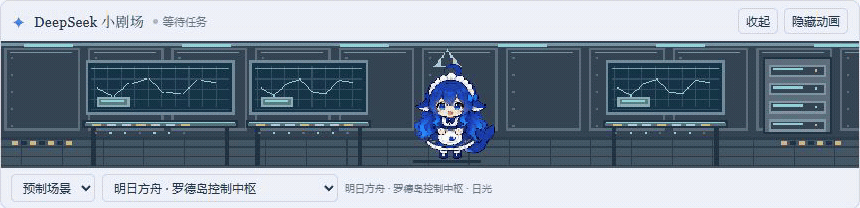

<p align="center">
  
</p>

<h1 align="center">DeepSeek Toons</h1>

<p align="center">
  <strong>让等待，有一点陪伴。</strong><br />
  给 DeepSeek Harness 原生聊天界面添加一只像素鲸鱼娘。<br />
  陪你翻书、敲键盘、找资料，任务结束后在小世界里闲逛。
</p>

<p align="center">
  <strong>v0.1.24</strong> · Harness <strong>0.2.0-rc.2</strong> · <a href="LICENSE">MIT</a>
</p>

<p align="center">
  <a href="#动画一览">动画一览</a> ·
  <a href="#当前功能">功能</a> ·
  <a href="#安装">安装</a> ·
  <a href="#开发与动作预览">开发与预览</a> ·
  <a href="docs/local-resource-packs.md">自定义角色与场景</a> ·
  <a href="design/character-walks.md">角色与行走素材</a>
</p>

## 动画一览

### 你工作，她也忙

阅读时趴着翻书，写代码时敲键盘；思考、搜索、测试和任务完成都有对应动作。

<p align="center">
  
</p>

### 给她一个像素小世界

12 个像素主题、24 个日光／暮色版本。书阁、工坊、鲸鱼港湾，也有罗德岛、列车车厢和蒙德风车广场。预制模式无需额外模型调用。

<p align="center">
  
</p>

<details>
<summary>看看她左右走路的样子</summary>

<p align="center">
  
</p>

默认鲸鱼娘 Deep seek 使用偏正面的八帧小步行走；Kimi、Gemini、Claude、Qwen、Grok 和 GLM 可在「本地资源」中直接选择。六个附加角色的腿、脚踝与鞋连续移动，完整裙摆和配饰保留在前景。任务完成后播放庆祝，再走走停停；本地闲逛不增加模型请求。

<p align="center">
  
</p>

素材结构、角色 ID 和重建命令见 [角色与行走素材](design/character-walks.md)。

</details>

## 当前功能

- 七个角色随插件安装：默认 Deep seek，以及 Kimi、Gemini、Claude、Qwen、Grok、GLM。六个附加角色首次选择时从当前 Harness Host 读取，随后在本次客户端运行期间缓存；无需外网或模型调用，每个角色支持十种八帧动作。角色与场景分别选择，自定义资源包继续独立保存。
- 行走与待机保持同一人物比例：Deep seek 采用偏正面小步步态，六个附加角色从各自待机图提取原始腿、脚踝与鞋连续变形，完整服装遮住腿根，头发、衣裙与配饰一起轻微起伏。左右方向镜像复用，原有动作时长与其他八种动作保留。
- 角色按实际可见图像适配画布：透明格子的留白不会把鞋子抬离地面，高举手等较高的自定义姿势也能完整显示；加载资源包时缓存可见边界，播放时复用。
- 0.1.16 内置动作全部升级为连续 8 帧，重做 2D 行走轮廓，修正脚底空缺，并在庆祝最后两帧加入烟花。
- 0.1.15 动态导演改为编排精细素材：[一次真实模型生成的宽窄画布效果](design/screenshots/model-director-v0115.png)。
- 原生插槽 `conversation.input.dock`，动画位于聊天输入框上方。
- 动画区高度固定：场景网格按舞台宽度换算列数（每格约 12 CSS 像素宽、固定 8 行），因此窗口再宽也保持约 168 像素高，不会挤压回复文本。下方控制区的「收起／展开」可把整条压成一行状态栏，收起时同时停止 Worker 和动态生成请求。顶部状态栏已移除，状态和收起按钮合并到下方控制区；原状态栏的空间用于增高画布，画面保持原像素比例。窄容器下控制区自动分两行。动画只保留这一组显示开关；旧版隐藏状态自动迁移为收起，点击「展开」即可恢复。
- 读取当前会话事件，区分思考、阅读、搜索、编辑、测试、构建、Git、资料检索、协作和回复状态。
- 预制场景重绘为 12 个像素主题、24 个日光／暮色版本：海风书桌、窗边书阁、像素工坊、玻璃花房、星空观测室、鲸鱼港湾、雨夜茶室、云端车站，以及明日方舟的罗德岛控制中枢、星穹铁道的列车观景车厢、终末地的武陵水畔、原神的蒙德风车广场。窗景、家具、地板、地毯按细像素绘制，人物居中；宽窗口补充背景细节，窄窗口保留完整人物和道具。旧场景代码保留作兼容参考，默认预制牌组不再选用。
- 预制主题说明与插件界面使用简体中文，动态导演要求中文描述和气泡台词。默认预制主题只播放本地动作和背景，没有独立模型气泡。文件名、命令和 Git 分支名保留原文。
- 角色按任务和场景播放逐帧动作：趴着翻书、交替敲键盘、思考、搜索观察、检查、庆祝与失落；任务完成后播放约 1.8 秒庆祝，再进入自由闲逛。首次打开空闲会话、失败结束或取消任务也会待机走动，约 1.2 秒后起步，每走到一处停留约 1.2～2.4 秒，再换个位置；停留时播放眨眼、轻微起伏。动态场景任务结束后也能在冻结背景上闲逛，人物沿用最后的站位起步，不增加模型请求。
- 左右走路各 8 帧：在预制与本地场景里走动、停留，阅读和敲键盘时走回工作位置，长时间工作会偶尔起身再返回。工具事件与场景轮换不会重置人物位置；移动沿用本地时钟与边界限制。导入角色使用自己的走路动作，缺少左右行走时保持原地，不把待机动画当走路平移。
- 每个实例使用独立 Web Worker。任务结束停止 Worker 和模型请求，人物和预制场景的小动效由本地时钟继续播放，不增加模型用量；收起、后台或系统“减少动态效果”会暂停播放。
- 默认预制模式，不调用额外模型；切换“动态混合”后，模型编排已有精细像素背景，选择主题、昼夜、角色动作、最多两件道具和两种特效，并根据鲸鱼娘人设自主生成气泡。道具包含饭碗、Token 饼干、西瓜、显存果冻、书本、终端、机柜和灯笼，特效包含萤火、蒸汽、雨、扫描、闪光和气泡。使用当前会话的 provider/model，可单独覆盖。详见 [动态场景说明](docs/dynamic-scenes.md)。
- 场景自动切换统一计时：预制场景至少展示 20 秒，动态场景从真正上屏开始至少展示 45 秒，再响应最新任务状态或每分钟轮换。暂停任务、收起和后台时间不计入展示时长；手动换主题或损坏场景回退立即生效，人物动作继续即时跟随任务。
- 动画导演单独选择该模型明确支持的轻量推理（优先 off，其次 minimal／low），保留主任务的推理设置。避免高推理耗尽导演的输出额度却没有生成正文。
- 动态生成限流、超时和取消；JSON／素材编排校验失败后使用预制场景。动画上下文独立于主会话消息，不调用工具。
- 回退提示显示具体原因，包括输出上限、空正文、JSON／编排校验失败、认证、额度和超时；不把提供方的原始错误或凭证写进提示和日志。
- 展示模型报告的额外 token；可选将用量写入本地 JSONL。
- 本地资源包：在下方「本地资源」中导入 ZIP / 内嵌图片 JSON，分别切换人物和场景，或应用整套；支持恢复默认、删除和同 ID 更新。资源与选择保存在当前客户端，离线可用。内置薄荷机器人／月光庭院示例；制作格式见 [本地资源包说明](docs/local-resource-packs.md)。

## 安装

先确认运行时版本：

```powershell
dsh --version
dsh plugin --profile web add .\dist\dsh-toons-0.1.24.tgz
dsh --profile web
```

在项目根目录运行以上命令。插件包包含 bundle patch，安装后由 profile 加载。已有 Web 服务需重启。桌面端可通过内置插件管理添加相同本地包；也可使用桌面安装目录自带的 `dsh.cmd` 命令行入口，将下例的 `<桌面安装目录>` 替换为实际目录：

```powershell
& '<桌面安装目录>\resources\runtime\cli\bin\dsh.cmd' plugin --profile desktop add .\dist\dsh-toons-0.1.24.tgz
```

桌面更新后需要退出并重新打开应用。已确认 Desktop 原生挂载与启用状态，并在实际配置的 DeepSeek 路由验证动态场景生成。

需要让桌面鲸鱼娘跟随 GitHub 更新时，按[桌面自动升级说明](docs/desktop-auto-update.md)启用 Windows 计划任务。它在独立副本中检查、构建并打包，完全退出桌面应用后再安装；较旧的远端版本会跳过。

版本不匹配时应先使用匹配运行时；本包没有放宽 peer 版本限制。

## 开发与动作预览

```powershell
npm ci
npm run typecheck
npm test
npm run build
npm run preview
```

以上开发命令均在项目根目录运行。六个附加角色的行走素材可用 `node scripts/compose-character-walks.mjs` 重建，默认将预览与校验记录写入 `work/character-walks/`；审定后追加 `--write` 更新正式 PNG 与 ZIP 中的行走素材。可按角色 ID 只处理指定角色，详见 [制作说明](design/character-walks.md)。

Windows 自动升级的隔离集成测试：

```powershell
powershell.exe -NoProfile -ExecutionPolicy Bypass -File .\tests\desktop-updater.test.ps1
```

动作预览地址为 `http://127.0.0.1:3088/`。它复用插件的组件、Worker、解释器和角色素材，支持选择内置角色、切换动作、暂停、收起／展开和主题；动态选项使用模拟导演编排展示背景、道具、特效和气泡，不调用模型。

预览页使用独立的本地 ZIP 素材模块，无需连接 Harness Host。正式插件通过当前 Host 按选择读取已安装的角色归档，客户端包不内嵌六份 ZIP；尚未加载的角色需要 Host 连接才能首次读取。

安装包重新生成：

```powershell
npm pack --pack-destination dist
```

## 隔离的 Harness 联调

```powershell
$env:DSH_HOME = Join-Path (Get-Location) "work/harness-home"
npm exec -- dsh --profile web --patch .\dev.patch.yml --patch .\tests\fixtures\offline.patch.yml --no-open --port 3087
```

`offline.patch.yml` 只用于测试：将默认模型设为无网络的模拟适配器。模拟适配器流式产生测试文本，也可响应动画导演请求；界面中的模拟 token 数不代表真实费用。测试文件不进入发布包。这个命令使用独立 home，不修改用户现有 Harness profile。

省略第二个 `--patch` 后使用这个隔离 profile 中配置的真实模型。开发 patch 固定使用页面内的目录浏览器，方便自动化测试；发布 bundle 不改变目录选择方式。

## 配置

在 profile 的 `cordis.patch.yml` 中按 id 覆盖配置；Harness patch 会替换整段 config：

```yaml
- id: dsh-toons
  config:
    enabled: true
    source: ready-made only
    fps: 20
    intervalMs: 60000
    timeoutMs: 45000
    maxTokens: 4000
    provider: ''
    model: ''
    stateDirectory: ''
```

`provider`、`model` 为空时采用当前会话的配置；`stateDirectory` 为空时不写用量日志。动态混合需用户在动画条中选择，它将把工具名称、短路径／命令摘要和状态发送给已配置模型。没有额外账号或 Anthropic 凭证读取逻辑。source 指定首次打开时的默认模式；浏览器保存的显式选择优先。

## 角色素材与当前边界

默认 Deep seek 的动作表位于 `assets/animations/`，每个动作均为 4 列 × 2 行的一套连续 8 帧。左右行走共用一张图集并水平镜像播放，共十种动作、80 个播放帧：

- `idle.png`、`think.png`、`search.png`、`check.png`：一次呼吸／眨眼、抬指思考、观察扫描、落笔检查的完整过程。
- `read.png`、`type.png`、`success.png`、`failed.png`：趴着完成一次翻页、左右手交替敲键盘、准备到欢呼再落地、失落到缓和。庆祝的第 7 帧点亮火花，第 8 帧展开烟花。
- `walk.png`：偏正面三分之四视角的小步行走，一套 8 帧，75 毫秒一帧，向右走时水平镜像同一序列。双眼和围裙正面保持可见，左腿高光随迈步、支撑和收脚移动；头发、衣服、手臂与鲸尾统一轻微起伏，鞋头保留接近待机的圆厚体积，人物中心与落脚线稳定。
- `assets/deepseek-girl-poses.png` 保留原素材作兼容回退。

六个附加角色位于 `assets/characters/<角色 ID>/`，包含 `manifest.json`、待机与工作／反应图集及 `walk-left.png`；每个角色支持十种八帧动作，行走每帧 100 毫秒，向右使用同一图集的镜像。完整 ZIP 位于 `examples/character-packs/`，可作为可导入资源包使用。界面内置选择使用 `builtin-` 前缀，与用户自行导入的同名角色分开；显示名称变化不改变角色 ID 或已有选择。当前行走素材与制作流程见 [角色与行走素材](design/character-walks.md)。

素材使用内置 image_gen 生成，采用最近邻缩放。每组动作共用根位置与脚底基线，避免手、书页或尾巴变化时整个人随裁切漂移；趴姿采用站姿的像素比例，保持更矮更宽。动作节奏按用途设置：敲键盘约每 50 毫秒切帧，阅读先停留再翻页，思考与检查较慢。读取动作优先于旧场景的走路指令；其他场景保留移动、朝向及举手等动作意图。

角色播放时钟独立于场景 Worker。后台、收起和“减少动态效果”会停止角色播放；任务结束会停止场景 Worker 与模型请求，角色完成短暂的庆祝／失落后进入循环待机。预制场景的蒸汽、星光、雨滴、波纹和窗外列车也采用本地时钟。窗口在待机时改变大小会重新布局单帧，不重启 Worker 的连续运行。八帧沿用原有动作总时长。生成图仍是像素风素材，尚未做严格的低分辨率色板重绘。

预制场景统一使用像素风。“任务像素场景”选择适合当前工作的主题，例如阅读选书阁／书桌、编辑选工坊／书桌；“全部像素主题”轮换全部 12 个主题，沿用旧版“全部风格”的保存值。下拉菜单还可直接选择任意游戏／日常主题；手选主题会切换至预制模式并保存选择，跨任务保持该主题。控制屏、星空、音乐音符、竹叶、水车、花瓣、风车和喷泉均由本地时钟驱动，不调用额外模型。切换主题复用已加载的角色素材和 Worker。动态导演仅返回受限的素材编排 JSON，由精细画布绘制；已有旧场景继续兼容绘图解释器，`clawd()` 和 `clawd3d()` 映射到固定女孩素材。汉字和全角标点按两列宽度绘制，气泡按实际列宽换行；支持中文文件名，字体优先使用系统中的微软雅黑／苹方／思源黑体。这里的“说中文”指文字气泡，没有添加语音朗读。

已完成官方 Web profile 中的原生挂载、无网络完整会话、动态生成、收起／展开及任务结束验证；Desktop 已确认挂载并启用。真实 deepseek-official/deepseek-flash 路由已验证一次轻量导演生成成功，未计算货币费用，其他模型的生成质量仍需分别验证。

## 来源

基于 [claude-toons](https://github.com/achimala/claude-toons) 的 MIT 代码改造；Harness 接入依据 [deepseek-harness](https://github.com/deepseek-ai/deepseek-harness) 的原生插件接口。详见 THIRD_PARTY_NOTICES.md。
